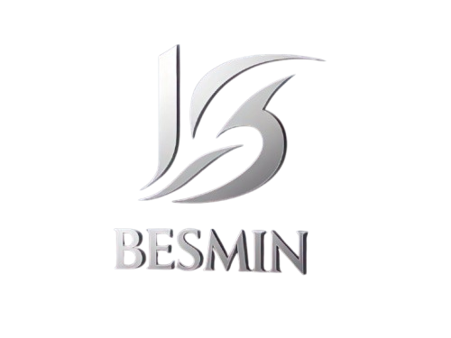

<h1 align="center">Build ECMAScript Minify</h1>

## Instalasi

```bash
npm install --global besmin
```

## Penggunaan

### Sintaks CLI

`besmin <inputDir> <outputDir> [cjs|umd|amd|sysjs] (or default [esm]) [--watch]`

### Argumen

- `<inputDir>`: Direktori input yang berisi file `.js`.
- `<outputDir>`: Direktori output untuk file hasil build.
- `[cjs|umd|amd|sysjs] (or default [esm])`: Format modul yang akan dibangun. Pilih satu atau lebih.
- `[--watch]`: Mengaktifkan mode pemantauan.

### Contoh Penggunaan

1. Build file JavaScript/TypeScript ke format CommonJS (CJS):
   ```bash
   besmin src dist cjs
   ```
2. Build ke beberapa format modul (default menggunakan ESM jika tidak ada format eksplisit):
   ```bash
   besmin src dist cjs esm umd
   ```
3. Build dan aktifkan mode pemantauan (watch mode):
   ```bash
   besmin src dist cjs esm --watch
   ```
4. Build default ECMAScript modules (ESM):
   ```bash
   besmin src dist
   ```

`besmin` membaca file `.js` dan `.ts`, melakukan transformasi menggunakan Babel, dan meminifikasi hasilnya dengan Terser. File hasil build disimpan di direktori output secara rekursif.

Jika mode `--watch` diaktifkan, `besmin` akan memantau perubahan di direktori input dan secara otomatis memvalidasi serta membangun ulang file yang terpengaruh.

## Dependencies

- [**fs-extra**](https://github.com/jprichardson/node-fs-extra): Operasi file yang diperluas.
- [**@babel/core**](https://babel.dev/): Alat transformasi kode modern.
- [**@babel/preset-env**](https://babel.dev/docs/babel-preset-env): Preset untuk mendukung target lingkungan tertentu.
- [**@babel/preset-typescript**](https://babel.dev/docs/babel-preset-typescript): Preset untuk mendukung TypeScript.
- [**@babel/plugin-transform-modules-commonjs**](https://babel.dev/docs/babel-plugin-transform-modules-commonjs): Plugin untuk mendukung CommonJS.
- [**@babel/plugin-transform-modules-umd**](https://babel.dev/docs/babel-plugin-transform-modules-umd): Plugin untuk mendukung UMD.
- [**@babel/plugin-transform-modules-amd**](https://babel.dev/docs/babel-plugin-transform-modules-amd): Plugin untuk mendukung AMD.
- [**@babel/plugin-transform-modules-systemjs**](https://babel.dev/docs/babel-plugin-transform-modules-systemjs): Plugin untuk mendukung SystemJS.
- [**terser**](https://terser.org/): Minifikasi kode JavaScript.
- [**chokidar**](https://github.com/paulmillr/chokidar): Pemantauan file dan direktori.
